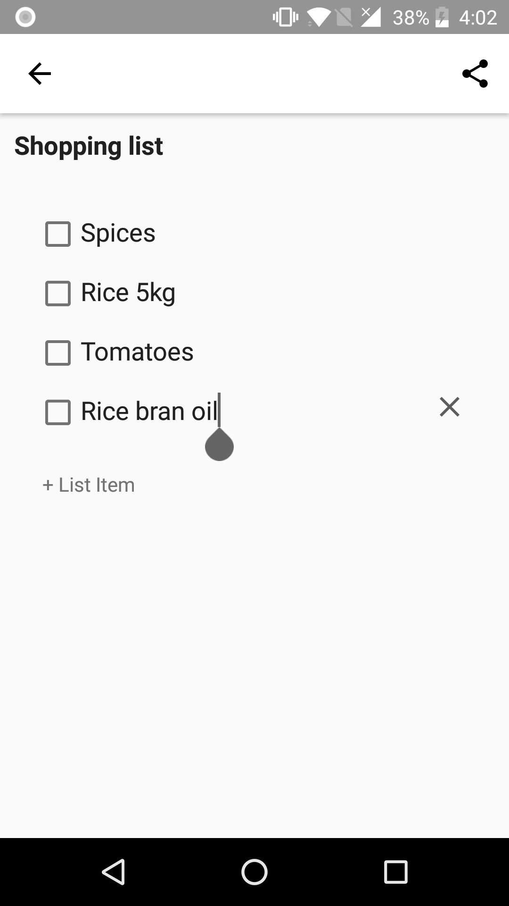
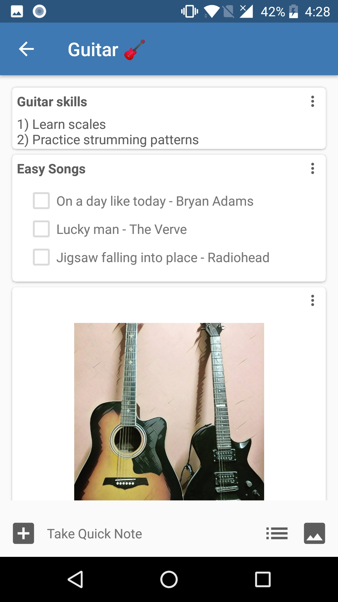
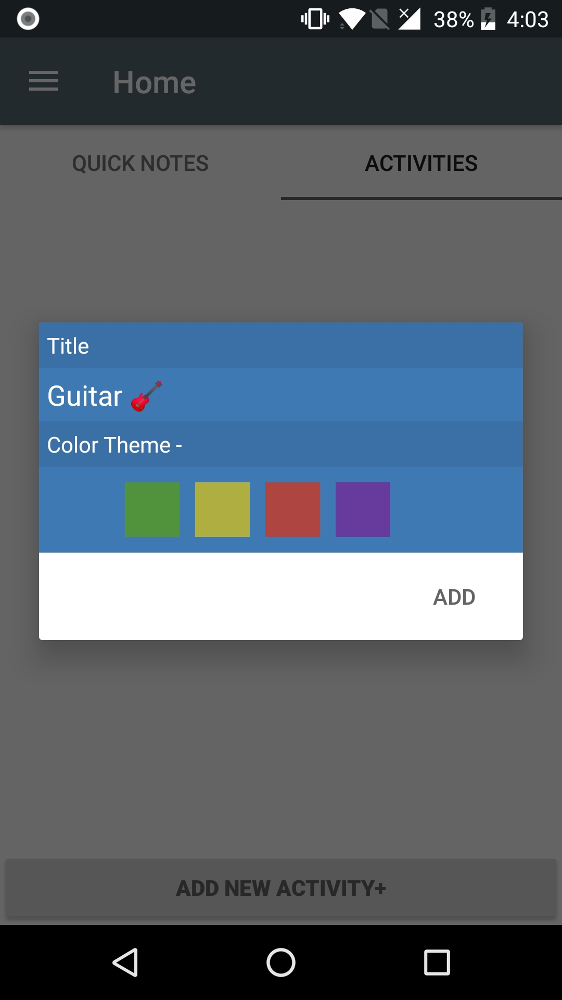
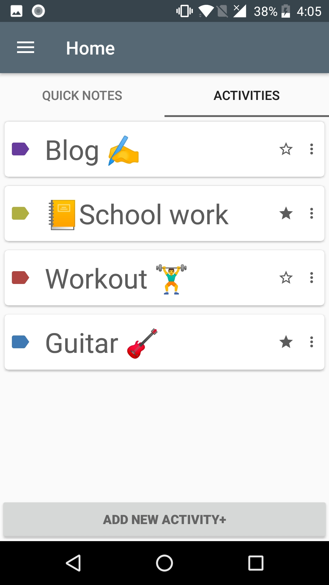
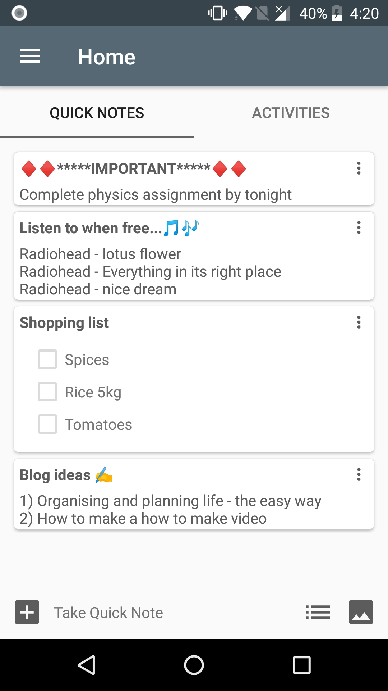

# ActivityDo
Plan and Organise notes as activities... 

## Features
* Take quick notes
* Organise notes as Activities
* Re-order notes and Activites
* Pin Activites to Navigation Bar
* Share notes

### Screenshots

### Notes
* Notes can be
    * Text
    * List
    * Picture

